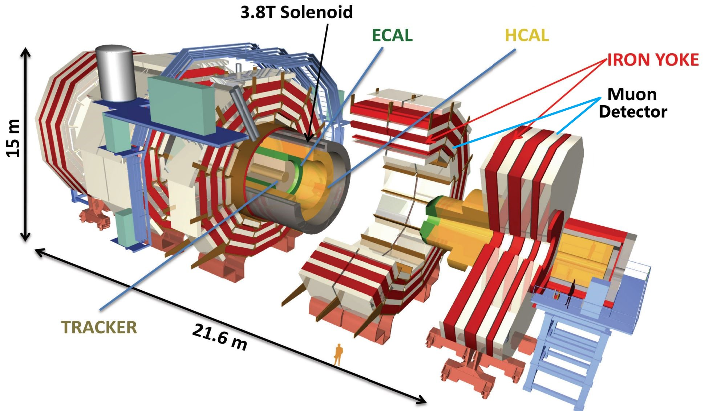
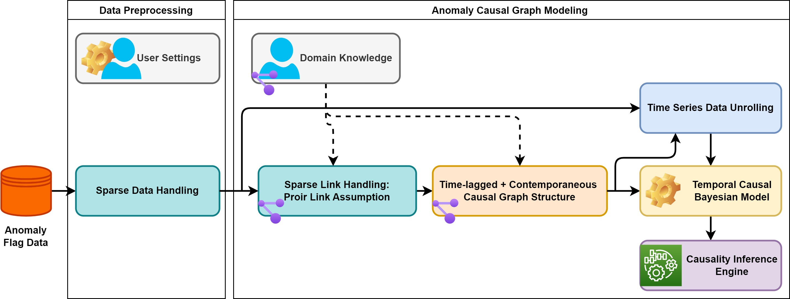
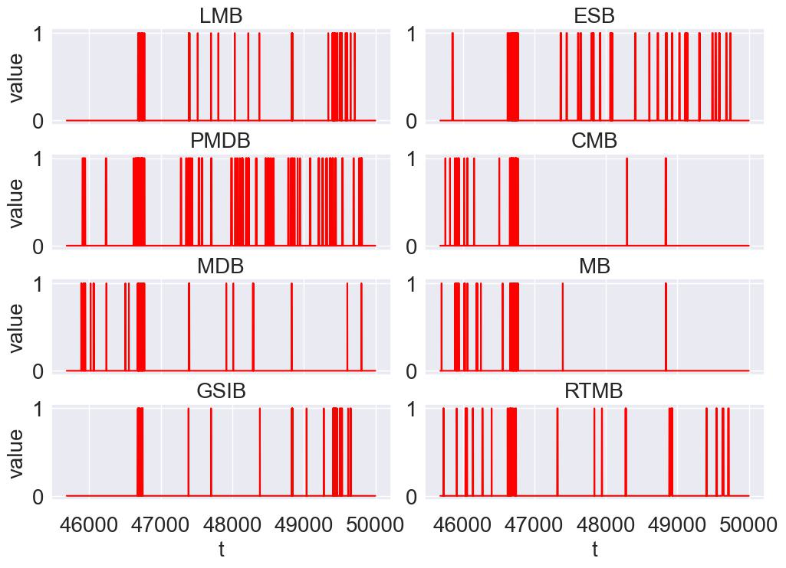
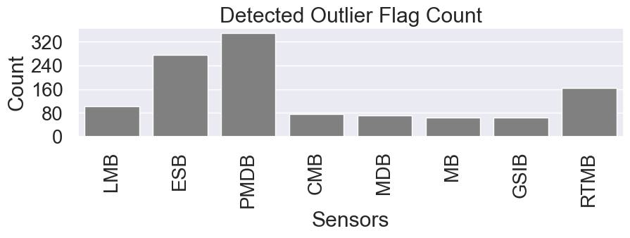
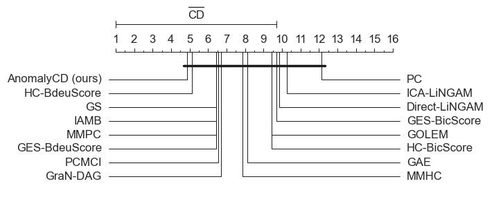
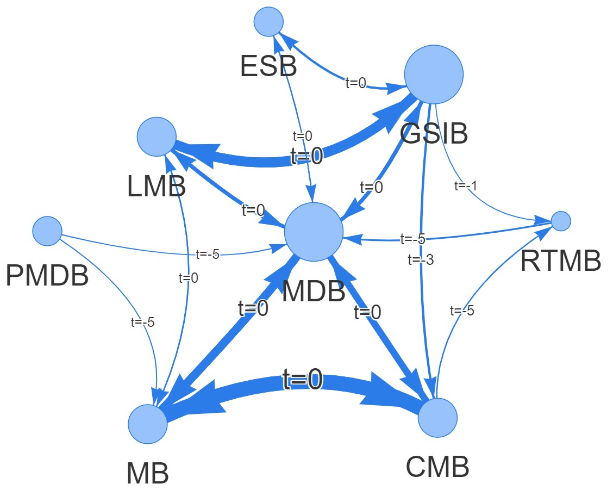

# AnomalyCD (Code is coming soon!!)
([Full Paper](https://www.mdpi.com/1424-8220/23/24/9679)) Scalable Temporal Anomaly Causality Discovery in Large Systems: Achieving Computational Efficiency with Binary Anomaly Flag Data

The repo is part of the DEtector System MOnitoring and Diagnostics (DESMOD) project, a collaboration between the CMS Experiment at CERN and the University of Agder, Norway.
The DESMOD aims to develop ML tools for the Hadron Calorimeter (HCAL)-Readout Boxes (RBXes). 
The modeling includes Anomaly Detection, Anomaly Prediction, and Root-Cause Analysis across large high-dimensional sensor data sets.




## Abstract 
Extracting anomaly causality facilitates diagnostics once monitoring systems detect system faults. 
Identifying anomaly causes in large systems involves investigating a more extensive set of monitoring variables across multiple subsystems. 
However, learning causal graphs comes with a significant computational burden that restrains the applicability of most existing methods in real-time and large-scale deployments.
In addition, modern monitoring applications for large systems often generate large amounts of binary alarm flags, and the distinct characteristics of binary anomaly data---the meaning of state transition and data sparsity---challenge existing causality learning mechanisms.
This study proposes an anomaly causal discovery approach (AnomalyCD), addressing the accuracy and computational challenges of generating causal graphs from binary flag data sets. The AnomalyCD framework presents several strategies, such as anomaly flag characteristics incorporating causality testing, sparse data and link compression, and edge pruning adjustment approaches. 
We validate the performance of this framework on two datasets: monitoring sensor data of the readout-box system of the Compact Muon Solenoid experiment at CERN, and a public data set for information technology monitoring.
The results demonstrate the considerable reduction of the computation overhead and moderate enhancement of the accuracy of temporal causal discovery on binary anomaly data sets.

## AnomalyCD System Design


 


## The CMS-HCAL Monitoring Sensor Data set
The CMS HCAL is a specialized calorimeter that captures hadronic particles during a collision event in the CMS experiment. 
The primary purpose of the HCAL is to measure the energy of hadrons by absorbing their energy and converting it into measurable signals. 
The calorimeter is composed of brass and plastic scintillators, and the scintillation light produced in the plastic is transmitted through wavelength-shifting fibers to Silicon photomultiplier (SiPMs). 
The HCAL front-end electronics consist of components responsible for sensing and digitizing optical signals of the collision particles. 
The front-end electronics are divided into sectors of readout boxes (RBXes) that house and provide voltage, backplane communications, and cooling to the data acquisition electronics.

## EasyVista Monitoring Public Data set ([Git Source](https://github.com/ckassaad/EasyRCA))
[EasyVista](https://www.easyvista.com/fr/produits/ev-observe) has provided a multivariate sensor dataset from their information technology monitoring system and made the data publicly available. 
The dataset consists of eight TS variables collected with a one-minute sampling rate.   


The generated TS anomaly-flag data using our online-AD on the EasyVista sensors.

 

Before and After Sparse Data COmpression

 

Before and After Edge Pruning and Adjustment

 


## Appendix  (Causal Discovery on Artificially Simulated Anomaly Data sets)


## BibTeX Citation

If you employ any part of the code, please kindly cite the following papers:
```
@article{asres2024anomalycd,
  title={Scalable Temporal Anomaly Causality Discovery in Large Systems: Achieving Computational Efficiency with Binary Anomaly Flag Data},
  author={Asres, Mulugeta Weldezgina and Omlin, Christian Walter and {The CMS-HCAL Collaboration}},
  journal={arXiv preprint arXiv:},
  year={2024}
}
```

