<div>
<!-- <a href="https://github.com/muleina/AnomalyCD/actions/workflows/python-package.yml"></a>-->
<a href="https://arxiv.org/abs/2412.11800"></a>
<a href="https://github.com/muleina/AnomalyCD/blob/main/notebooks/AnomalyCD_on_CMS_HCAL_Data_Outlier_Detection.ipynb"></a>
<a href="https://github.com/muleina/AnomalyCD/blob/main/notebooks/AnomalyCD_on_CMS_HCAL_Data_Causal_Discovery_TS.ipynb"></a>
<a href="https://cmshcalweb01.cern.ch/desmod/"></a>

# AnomalyCD
Official implementation of the journal paper on "AnomalyCD: *Scalable Temporal Anomaly Causality Discovery in Large Systems: Achieving Computational Efficiency with Binary Anomaly Flag Data*".

The AnomalyCD integrated pipeline for computationally efficient tools for graphical causal discovery (CD) from large binary anomaly data sets.
 Compared to PCMCI: AnomalyCD achieves 8 to 10X speed boost, 14%-57% spurious graph link reduction, gain F1, FPR, and SHDU by 20.5%, 47%, and 41%, respectively, demonstrating improved GCM accuracy. 

This repo is part of the [DEtector System MOnitoring and Diagnostics (DESMOD)](https://cmshcalweb01.cern.ch/desmod) project, a collaboration between the [CMS Experiment at CERN](https://home.cern) and the [University of Agder](https://www.uia.no), Norway.
The DESMOD aims to develop ML tools for the Hadron Calorimeter (HCAL)-Readout Boxes (RBXes), and it includes Anomaly Detection, Anomaly Prediction, and Root-Cause Analysis across large high-dimensional sensor data.

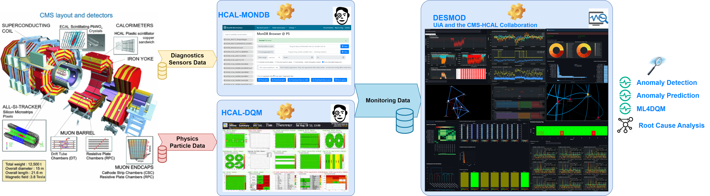 

## Abstract 
Extracting anomaly causality facilitates diagnostics once monitoring systems detect system faults. 
Identifying anomaly causes in large systems involves investigating a broader set of monitoring variables across multiple subsystems. 
However, learning causal graphs comes with a significant computational burden that restrains the applicability of most existing methods in real-time and large-scale deployments.
In addition, modern monitoring applications for large systems often generate large amounts of binary alarm flags, and the distinct characteristics of binary anomaly data---the meaning of state transition and data sparsity---challenge existing causality learning mechanisms.
This study proposes an anomaly causal discovery approach (AnomalyCD), addressing the accuracy and computational challenges of generating graphical causal modeling (GCM) from binary flag data sets. 
The AnomalyCD framework presents several strategies, such as anomaly data-aware causality testing (ANAC), sparse data and prior link assemption compression (SDLH), and edge pruning adjustment approaches. 
We validate the performance of this framework on two datasets: monitoring sensor data of the readout-box system of the Compact Muon Solenoid experiment at CERN, and a public data set for information technology monitoring.
The temporal causal discovery results demonstrate a considerable reduction of computation overhead and a moderate enhancement of accuracy on the binary anomaly data sets. 

## AnomalyCD System Design

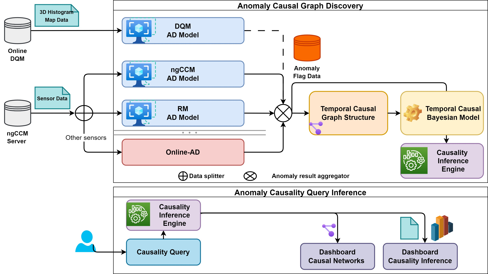

<!-- 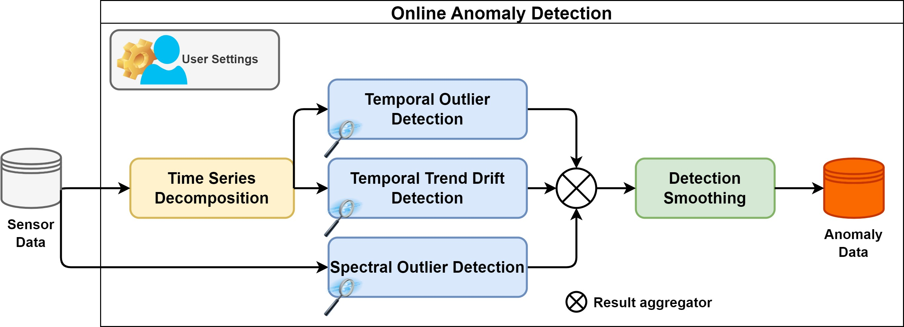 -->

<!-- START doctoc -->
**Table of Contents**
- [Installation](https://github.com/muleina/AnomalyCD#installation)
- [Usage-Notebook](https://github.com/muleina/AnomalyCD#usage-notebook)
- [Results: CMS-HCAL Monitoring Sensor Dataset](https://github.com/muleina/AnomalyCD#The-CMS-HCAL-Monitoring-Sensor-Dataset)
- [Results: EasyVista Monitoring Public Dataset](https://github.com/muleina/AnomalyCD#EasyVista-Monitoring-Public-Dataset)
- [Computational Cost Analysis](https://github.com/muleina/AnomalyCD#Computational-Cost-Analysis)
- [BibTeX Citation](https://github.com/muleina/AnomalyCD#BibTeX-Citation)

<!-- END doctoc generated TOC please keep comment here to allow auto update -->

## Installation

  The requirements.txt will be added soon!
  
    # Anaconda install options: using yml
    conda env create -f conda_environment.yml

    # Anaconda install options: using txt
    conda create --name anomalycd --file conda_requirements.txt

    # Pip install to existing environment.
    pip install -r pip_requirements.txt

## Usage-Notebook

We provide below notebooks for a step-wise result generation of the AnomalyCD pipeline using different data sources. 

-  [HCAL Temporal Online-AD Notebook](https://github.com/muleina/AnomalyCD/blob/main/notebooks/AnomalyCD_on_CMS_HCAL_Data_Outlier_Detection.ipynb) <a href="https://colab.research.google.com/github/muleina/AnomalyCD/blob/main/notebooks/AnomalyCD_on_CMS_HCAL_Data_Outlier_Detection.ipynb"></a> 
-  [HCAL Temporal Anomaly-CD Notebook](https://github.com/muleina/AnomalyCD/blob/main/notebooks/AnomalyCD_on_CMS_HCAL_Data_Causal_Discovery_TS.ipynb) <a href="https://colab.research.google.com/github/muleina/AnomalyCD/blob/main/notebooks/AnomalyCD_on_CMS_HCAL_Data_Causal_Discovery_TS.ipynb"></a> 
-  [EasyVista Temporal Online-AD Notebook](https://github.com/muleina/AnomalyCD/blob/main/notebooks/AnomalyCD_on_EasyVista_Data_Outlier_Detection.ipynb) <a href="https://colab.research.google.com/github/muleina/AnomalyCD/blob/main/notebooks/AnomalyCD_on_EasyVista_Data_Outlier_Detection.ipynb"></a> 
-  [EasyVista Temporal Anomaly-CD Notebook](https://github.com/muleina/AnomalyCD/blob/main/notebooks/AnomalyCD_on_EasyVista_Data_Causal_Discovery_TS.ipynb) <a href="https://colab.research.google.com/github/muleina/AnomalyCD/blob/main/notebooks/AnomalyCD_on_EasyVista_Data_Causal_Discovery_TS.ipynb"></a>

## The CMS-HCAL Monitoring Sensor Dataset

The CMS HCAL is a specialized calorimeter that captures hadronic particles during a collision event in the CMS experiment. 
The sensor dataset (2022) contains 4.8M samples from 12 sensors per readout box (RBX), sourced from 36 RBXes of the HCAL front-end electronics that consist of components responsible for sensing and digitizing optical signals of the collision particles. 

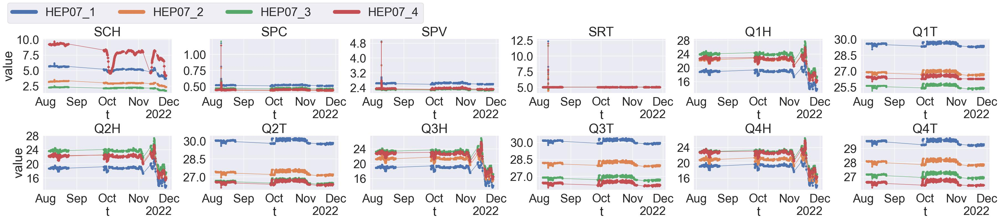

### Online-AD

Anomaly detection using our lightwight outlier detection algorithms for time series data sets. 

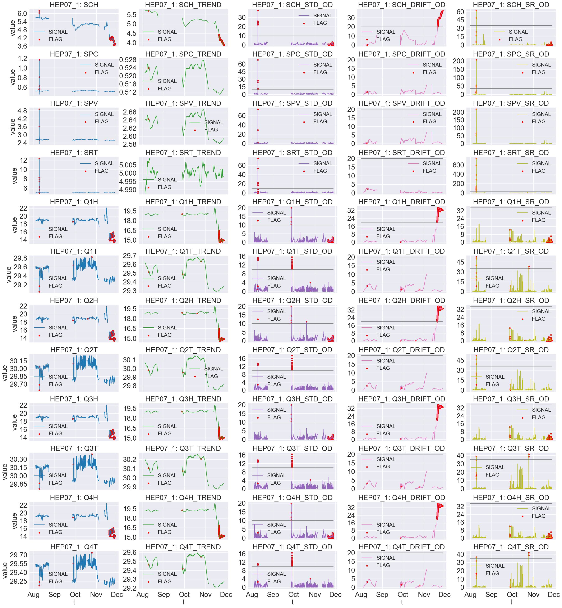

### AnomalyCD

Anomaly temporal graphical causal modeling (GCM) on the binary anomaly flags generated from the online-AD. 

AnomalyCD: sparse data compression reduces the data from 400K to 900 samples (99.8% reduction)


AnomalyCD: graphical causal modeling


AnomalyCD: Performance evaluation


The more results are in the paper!

## EasyVista Monitoring Public Dataset

[EasyVista](https://www.easyvista.com/fr/produits/ev-observe) is a publicly available sensor data from their IT monitoring system and can be downlaoded from [here](https://github.com/ckassaad/EasyRCA).
The dataset consists of 8 time series variables collected .   

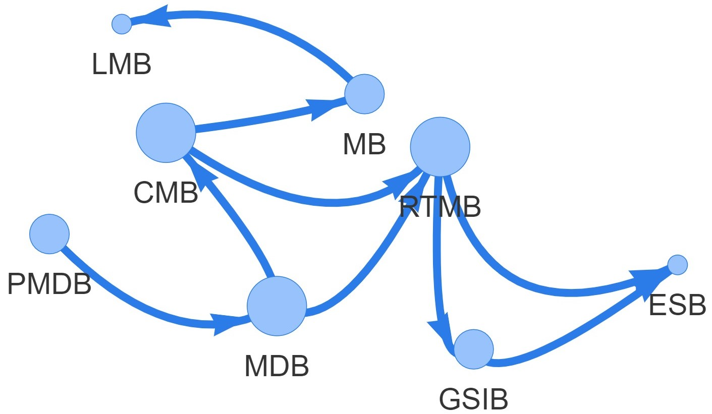 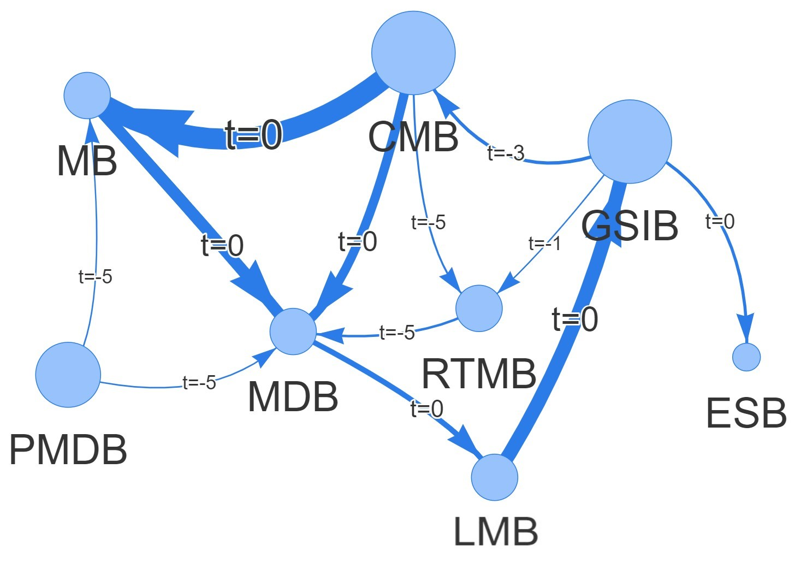

### AnomalyCD

The sparse data compression reduces the data from 4.3K to 1.9K samples (55% reduction). 

Performance evaluation

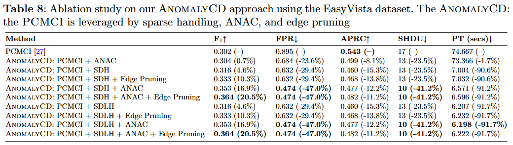

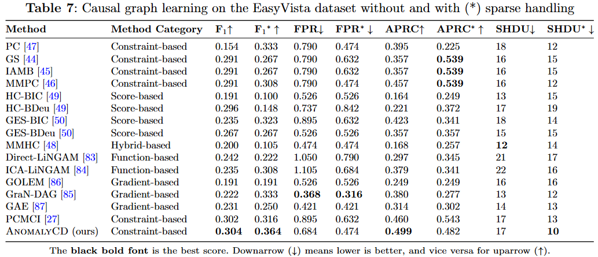

## Computational Cost Analysis

Using Intel(R) Xeon(R) Platinum 8168 CPU @ 2.70GHz with 64GB RAM. Our AnomalyCD has acheived compared to the PCMCI:
- On the HCAL dataset with 99.8% data and 57% link compression.
- 8 to 10X speed boost with half of the memory requirement on the EasyVista dataset with 55% data and 14% link compression. 

Computational Cost on HCAL dataset

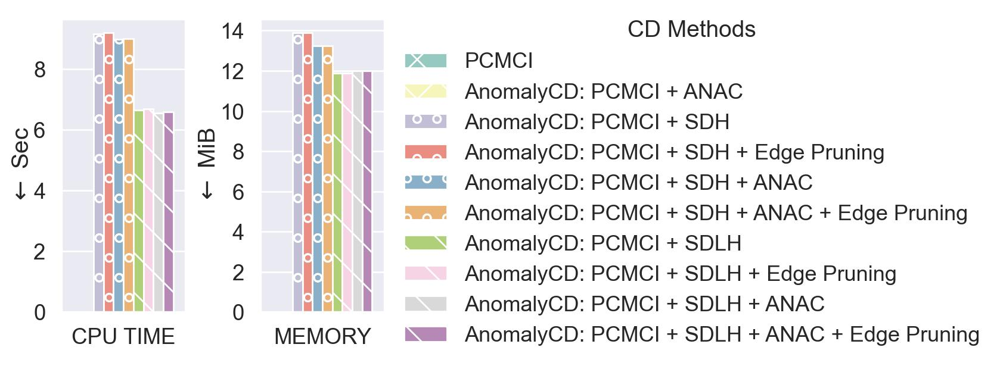

Computational Cost on HCAL dataset

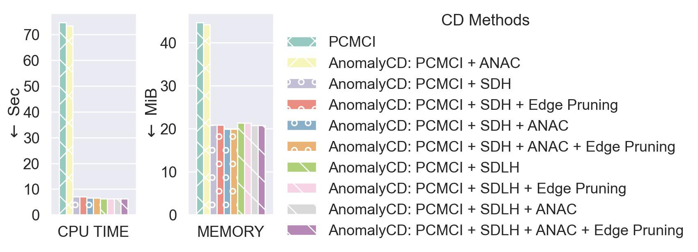

## BibTeX Citation

If you employ any part of the code, please kindly cite the following papers:
```
@article{asres2024anomalycd,
  title={Scalable Temporal Anomaly Causality Discovery in Large Systems: Achieving Computational Efficiency with Binary Anomaly Flag Data},
  author={Asres, Mulugeta Weldezgina and Omlin, Christian Walter and {The CMS-HCAL Collaboration}},
  journal={arXiv preprint arXiv:2412.11800},
  year={2024}
}
```

