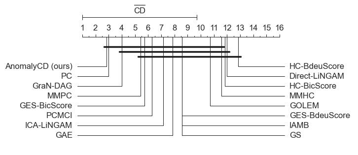
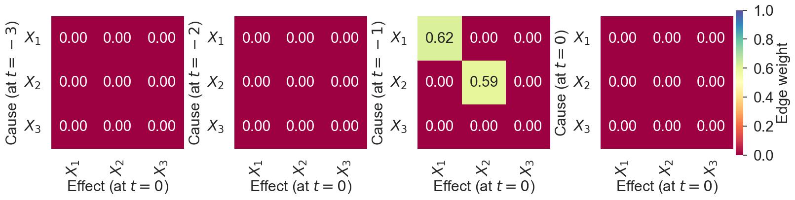

# AnomalyCD (code is coming soon!!) ([Full Paper](https://arxiv.org/abs/2412.11800))
Scalable Temporal Anomaly Causality Discovery in Large Systems: Achieving Computational Efficiency with Binary Anomaly Flag Data

The repo is part of the DEtector System MOnitoring and Diagnostics (DESMOD) project, a collaboration between the CMS Experiment at CERN and the University of Agder, Norway.
The DESMOD aims to develop ML tools for the Hadron Calorimeter (HCAL)-Readout Boxes (RBXes). 
The modeling includes Anomaly Detection, Anomaly Prediction, and Root-Cause Analysis across large high-dimensional sensor data sets.


## Abstract 
Extracting anomaly causality facilitates diagnostics once monitoring systems detect system faults. 
Identifying anomaly causes in large systems involves investigating a more extensive set of monitoring variables across multiple subsystems. 
However, learning causal graphs comes with a significant computational burden that restrains the applicability of most existing methods in real-time and large-scale deployments.
In addition, modern monitoring applications for large systems often generate large amounts of binary alarm flags, and the distinct characteristics of binary anomaly data---the meaning of state transition and data sparsity---challenge existing causality learning mechanisms.
This study proposes an anomaly causal discovery approach (AnomalyCD), addressing the accuracy and computational challenges of generating causal graphs from binary flag data sets. The AnomalyCD framework presents several strategies, such as anomaly flag characteristics incorporating causality testing, sparse data and link compression, and edge pruning adjustment approaches. 
We validate the performance of this framework on two datasets: monitoring sensor data of the readout-box system of the Compact Muon Solenoid experiment at CERN, and a public data set for information technology monitoring.
The results demonstrate the considerable reduction of the computation overhead and moderate enhancement of the accuracy of temporal causal discovery on binary anomaly data sets.

## AnomalyCD System Design


 


## The CMS-HCAL Monitoring Sensor Data set

The CMS HCAL is a specialized calorimeter that captures hadronic particles during a collision event in the CMS experiment. 
The primary purpose of the HCAL is to measure the energy of hadrons by absorbing their energy and converting it into measurable signals. 
The calorimeter is composed of brass and plastic scintillators, and the scintillation light produced in the plastic is transmitted through wavelength-shifting fibers to Silicon photomultiplier (SiPMs). 
The HCAL front-end electronics consist of components responsible for sensing and digitizing optical signals of the collision particles. 
The front-end electronics are divided into sectors of readout boxes (RBXes) that house and provide voltage, backplane communications, and cooling to the data acquisition electronics.

Results are in the paper and will be added to the git soon!

## EasyVista Monitoring Public Data set ([Git Source](https://github.com/ckassaad/EasyRCA))

[EasyVista](https://www.easyvista.com/fr/produits/ev-observe) has provided a multivariate sensor dataset from their information technology monitoring system and made the data publicly available. 
The dataset consists of eight TS variables collected with a one-minute sampling rate.   


The generated TS anomaly-flag data using our online-AD on the EasyVista sensors.

 

Before and After Sparse Data COmpression

 

Before and After Edge Pruning and Adjustment

 


## Appendix  (Causal Discovery on Simulated Binary Anomaly Time Series Data sets)

We simulate different realistic challenges of CD on TS binary anomaly data for the empirical assessment compared with a ground truth graph causal model (GCM) from three nodes: $X_1$, $X_2$, $X_3$.
We will present the results below using Latent PCMCI, PCMCI augmented with FCI for unseen confounding handling, as it achieves better accuracy for small data sets than its predecessors. But, it may become significantly slower than the predecessors for larger data sets.
We will also briefly discuss an unrolling TS approach inspired by the time-aware PC algorithm (TPC) to present its advantages and limitations compared to the PCMCI.
We employ our ANAC test, using partial Pearson's correlation, among the variables. The one-sided correlation score captures positive relations considering anomaly causality in the increase direction. 
We set the maximum causality search time-lag $\tau_{max}=3$ for all the experiments, and edge weights below $0.001$ are pruned.

### Challenge-1: Binary Anomaly Data Sparsity Compression

A binary anomaly data is synthetically generated for $(X_1$ with long time windows of constant anomaly status (sparse regions), and then temporally causally dependent variables $X_2$ and $X_3$ are derived using $(X_1 - 1) \rightarrow X_2$ and $(X_2 - 3) \rightarrow X_3$. We set the maximum time-lag $\tau_{max}=3$ for causality search that excludes the deduced edge $(X_1 - 4) \rightarrow X_3$.
Our proposed sparsity handler method enables capturing causality information from the anomaly flag transition edges by avoiding extended constant status regions. 
The algorithm has compressed the expended regions--beyond the target causality search maximum time-lag--and lessened the computation cost of the GCM discovery substantially; it has also reduced Type-I--false positive edges--errors.

(Left) Raw time series binary anomaly flag with marked sparse regions, and (Right) compressed data after sparsity handling. The sparsity handler has decreased the data samples and the average PCMCI computation time by around 60\% and 42\%, respectively.

 

The compressed data results in correct causal graph structure ($\text{APRC}=1.00$ and $\text{SHD}=0$) at different CI threshold $p_v$, whereas the sparse data causes spurious links $(X_1 - 1) \rightarrow X_1$ and $(X_2 - 1) \rightarrow X_2$ that lower APRC and increase SHD scores to 0.83 and 1, respectively.
(Left) the $\text{APRC}=0.83$ and $\text{SHD}=1$, and $\text{APRC}=1.00$ and $\text{SHD}=0$ for all the $p_v$ values for the raw and compressed data, respectively, and (Right)  processing time distribution.

 

Heat maps of the estimated temporal graph edge weights at $p_v$=0.05 using (Left) raw and (Right) compressed binary anomaly data.

 


### Challenge-2: Incomplete Stationary Binary Data

System interruption often follows for maintenance or prevention of further damage after anomaly alerts. 
We generated temporally incomplete anomaly data when the anomaly signals from all the variables reset to zero when a system interruption occurs;
we utilized the binary data from the previous section--i.e., $(X_1 - 1) \rightarrow X_2$ and $(X_2 - 3) \rightarrow X_3$--and applied an interruption condition $X_1=0 \cap X_2=0 \cap X_3=1$.

Time series binary anomaly flag (Left) without interruption and (Right) with interruption at $X_3$.
 

The data incompleteness significantly diminishes the edge weight between $(X_2 - 1) \rightarrow X_3$ from $1.00 \rightarrow 0.28$, introduces spurious links at higher $p_v$, and removes proper edges at lower $p_v$.


The estimated temporal GCM heat maps on incomplete binary anomaly data: (Left) $p_v$=0.0001 ($\text{APRC}=0.77$ and $\text{SHD}=1$), and  (Right) $p_v$=0.05 ($\text{APRC}=0.75$ and $\text{SHD}=2$)

 

Challenge-3: Incomplete Non-stationary Binary Data
One of the most challenging tasks in dealing with real-world time series binary anomaly flag data is non-stationary causality--different interactions are present at different times.
A few studies propose mitigation strategies for non-stationarity, e.g., partitioning the data into disjoint time windows and expecting each to have its causal network. However, most temporal CD studies assume stationary causality. 
The time windowing omits relations across windows, and results may vary with the choice of window size. 
We assess the impact of having non-stationary causality in anomaly data and drive guiding insights that might be relevant for tuning and building an anomaly causality network. 

We inject non-stationarity at $t>30$ by setting $X_1=0$ that removes the edge $(X_1 - 1) \rightarrow X_2$ on the incomplete anomaly data--generated in the previous section.
We first generated temporal binary anomaly flag data using $(X_1 - 1) \rightarrow X_2$ and $(X_2 - 3) \rightarrow X_3$ with an interruption condition $X_1=0 \cap X_2=0 \cap X_3=1$ and non-stationarity injected at $t>30$ on $X_1$: 

(LEFT) anomaly data with the interruption condition and (RIGHT) after the non-stationarity is applied on $X_1$.

 

The discovered graphs have spurious self-time-lagged edges ($\text{APRC}=0.75$ and $\text{SHD}=2$ for all $p_v$), and the edge weights are reduced below 1.00 for the correct links. 


The estimated temporal GCM heat maps on incomplete and non-stationary binary anomaly data: (LEFT) $p_v$=0.0001 ($\text{APRC}=0.75$ and $\text{SHD}=2$), and (RIGHT) $p_v$=0.05 ($\text{APRC}=0.75$ and $\text{SHD}=2$).

 


We leverage the PCMIC algorithm with a prior anomaly causality link assumption that excludes causality from self-time-lag edges to improve its capability: 

      $X_1$: {(2, 0): 'o?o', (2, -1): 'o?>', (2, -2): 'o?>', (2, -3): 'o?>', (3, 0): 'o?o', (3, -1): 'o?>', (3, -2): 'o?>', (3, -3): 'o?>'}
      $X_2$:: {(1, 0): 'o?o', (1, -1): 'o?>', (1, -2): 'o?>', (1, -3): 'o?>', (3, 0): 'o?o', (3, -1): 'o?>', (3, -2): 'o?>', (3, -3): 'o?>'}
      $X_3$:: {(1, 0): 'o?o', (1, -1): 'o?>', (1, -2): 'o?>', (1, -3): 'o?>', (2, 0): 'o?o', (2, -1): 'o?>', (2, -2): 'o?>', (2, -3): 'o?>'}

The prior link assumption has enhanced the PCMCI in detecting the causal graph accurately, except at high $p_v$=0.05, by mitigating the false edges and increasing weights of the true edges incomplete and non-stationary binary anomaly data.


Discovered temporal GCM heat maps using prior link assumption on incomplete and non-stationary binary anomaly data: a) $p_v$=0.0001 ($\text{APRC}=1.00$ and $\text{SHD}=0$), and b) $p_v$=0.05 ($\text{APRC}=0.75$ and $\text{SHD}=2$).

 


### Addressing Challenge-3 through Time Series Unrolling Mechanism

(Biswas, 2022) proposes a promising TPC that employs unrolling the TS data--by adding new nodes with time delay tags--to generate DAG using the PC algorithm.
The authors apply a set of conditions, such as causality not being directed backward in time and weight threshold, to direct edges and prune the DAG, respectively, when rolling the DAG. 
We have evaluated the unrolling approach with PCMCI~\cite{gerhardus2020high} to validate its advantages on the temporal CD of binary anomaly data.
We employ PCMCI instead of PC because the FCI in the PCMCI can handle confounding effects, and causality detection is enhanced with MCI; the PCMCI also enables us to compare with previous results consistently.

Unrolled binary anomaly flag time series data up to maximum time-lag $t=-3$. The temporal binary anomaly flag data using $(X_1 - 1) \rightarrow X_2$ and $(X_2 - 3) \rightarrow X_3$ with an interruption condition $(X_1=0) \cap (X_2=0) \cap (X_3=1)$ and non-stationarity injected at $t>30$ on $X_1$.


The unrolling approach suffers from false contemporaneous and self-lagged links.


The estimated temporal GCM heat maps on unrolled incomplete and non-stationary binary anomaly data: (LEFT) $p_v$=0.0001 ($\text{APRC}=0$ and $\text{SHD}=4$), and (RIGHT) $p_v$=0.05 ($\text{APRC}=0.67$ and $\text{SHD}=4$).

 


The performance substantially improves with a prior anomaly link assumption; it still does not work best for extreme $p_v$.


The estimated temporal GCM heat maps using prior temporal link assumption on unrolled incomplete and non-stationary binary anomaly data: (LEFT) $p_v$=0.0001 ($\text{APRC}=0$ and $\text{SHD}=4$), and (RIGHT) $p_v$=0.05 ($\text{APRC}=0.70$ and $\text{SHD}=3$).

 


We have found two major potential disadvantages of the unrolling approach for GCM learning: 1) the computation increases with the variable and time lag dimensions--limited impact on relieving computational overhead, and 2) it needs more effort in tuning reasonable $p_v$ than using the PCMCI directly.


## BibTeX Citation

If you employ any part of the code, please kindly cite the following papers:
```
@article{asres2024anomalycd,
  title={Scalable Temporal Anomaly Causality Discovery in Large Systems: Achieving Computational Efficiency with Binary Anomaly Flag Data},
  author={Asres, Mulugeta Weldezgina and Omlin, Christian Walter and {The CMS-HCAL Collaboration}},
  journal={arXiv preprint arXiv:2412.11800},
  year={2024}
}
```

